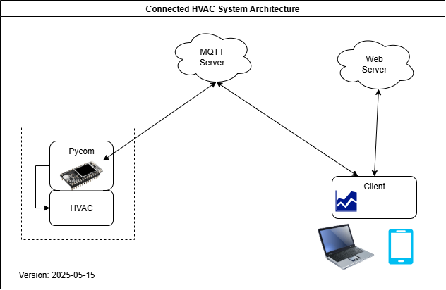

# SmartHVAC

Demo of a connected vehicle Air Conditionning

---
## System Architecture

## Components

### MQTT Server
[HiveMQ](https://www.hivemq.com/)

### HVAC+Pycom
[Pycom Module](https://docs.pycom.io/datasheets/development/wipy3/)

### Front End

**Features**
-HVAC control
	- on/off control
	- Temperature settings
- Temperature display
- MQTT server Connection status

---

## **Changes**
| Date | Version | Description |
|:------------|:----------------:|--------------------------------------|
| **2025-05-15** | `Version 1.0` | `Final Release fully operational` :tada: |
| **2025-01-01** | `Version 0.1` | `Project kick off` :rocket: |

---
